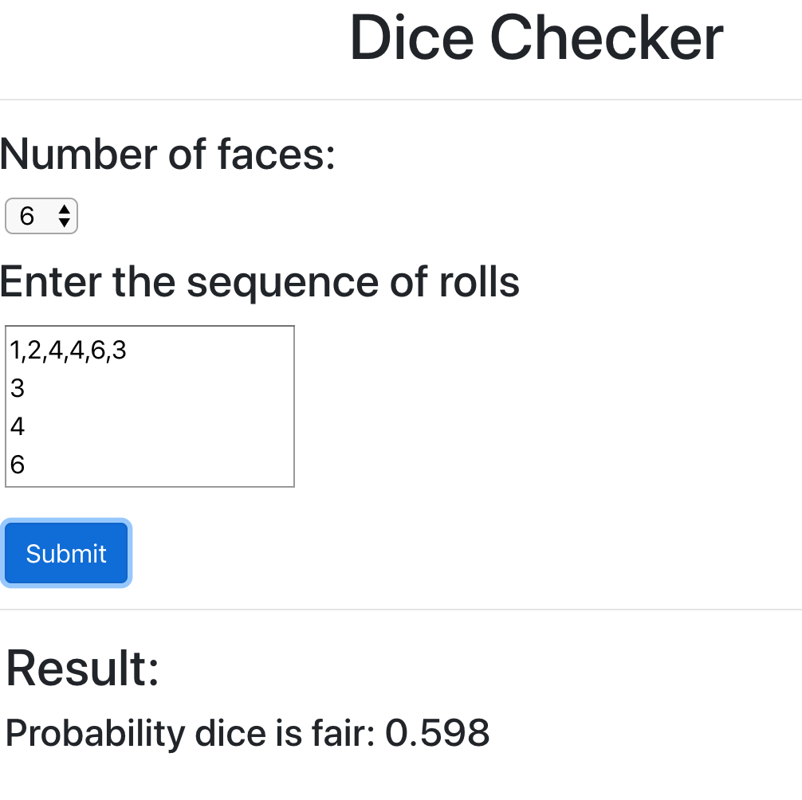

# Dice Checker

This repository contains ReactJS code to 
check if a dice is fair using the Chi-Squared test

## How to install and execute
You can run it as any React app using `npm start`

Live version of the code is [here](https://dice-checker.firebaseapp.com/)

## Sample Screenshot

## Whom to contact?

Please direct your queries to [gpavanb1](http://github.com/gpavanb1)
for any questions.
